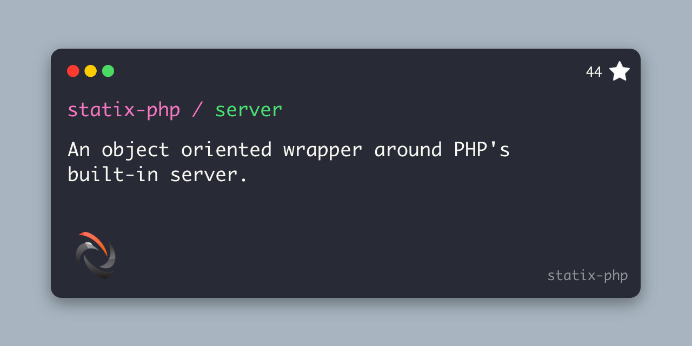

# Statix Server



## Requirements

- PHP 8 minumum

## Installation

```bash
composer require statix/server
```

View on packagist: [https://packagist.org/packages/statix/server](https://packagist.org/packages/statix/server)

## Basic Usage

To get started, ensure the vendor autoload script is required and then create an instance of the `Server` class, once you have set any [configuration options](#configuration), you should call the `start` method to start the server. 

```php
use Statix\Server\Server;

require_once './vendor/autoload.php';

Server::new()->start();

// or 

(new Server)->start();
```

## Configuration

You can configure the several options with the server, such as the host, the port, the root directory and more. Please read more below for a detailed explanation of each configuration method.

### Passing configuration via the constructor or Server::new()

You may pass most configuration options via the constructor. For example we are setting the `host`, `port` and `root` options in the code below. 

```PHP
use Statix\Server\Server;

Server::new([
    'host' => 'localhost',
    'port' => 8000,
    'root' => __DIR__ . '/content'
]);

// or 

new Server([
    'host' => 'localhost',
    'port' => 8000,
    'root' => __DIR__ . '/content'
]);
```

The complete list of configuration items that can be passed via the constructor can be found below. 

```PHP
$optionsSettableViaContructor = [
    'host' => 'string', // default: localhost
    'port' => 'string|int', // default: 8000
    'root' => 'string', // default: getcwd()
    'router' => 'string', // path to your routing script
    'php' => 'string', // path to the desired PHP binary to use for the server process
    'withEnvVars' => [
        'APP_DYNAMIC_ENV' => 'server'
    ],
    'withoutEnvVars' => [ 
        'APP_KEY'
    ]
];
```

### Setting configuration via the named methods

You also have the option of calling named methods to set the configuration options as shown below. 

```PHP
use Statix\Server\Server;

Server::new()
    ->php('path') 
    ->host('localhost') 
    ->port('8080') 
    ->root('./content')
    ->router('./router.php')
    ->withEnvVars([
        'APP_DYNAMIC_ENV' => 'server'
    ])->withoutEnvVars([
        'APP_KEY',
    ])->withEnvFile('path/to/.env');
```

### Capturing the output from the server process

If you want to show the output from the server process as it recieves and handles requests, you may call the `output` method and pass a callback function that will be called and passed any output of the process.

```PHP
Server::new()
    ->output(function($output) {
        echo $output;
    })->start();
```

### Running the process in the background

You may find it useful to run the server process in the background, you may call `runInBackground()`. The process will run as long as the parent script is running. 

```PHP
Server::new()->runInBackground();
```

### Checking whether the process is running

You may check whether or not the server is currently running by calling the `isRunning` method.

```PHP
$server = Server::new()->withEnvVars([
    'APP_NAME' => 'statix/server',
]);

$server->isRunning(); // false

$server->runInBackground();

$server->isRunning(); // true
```

### Stopping the server

You may stop the process running the sever by calling the stop command on an instance of the server class. If the server is not currently running this method will return `null` otherwise it will return an array container first the process exit code and second the process exit text. Note this command can only be called when the server is running in the background.

```PHP
$server = Server::new()->runInBackground();

// do work

$server->stop();
```

### Restarting the server

You can restart the server by calling the `restart` method on an instance of the server class. An example of why you might need to restart the server is detecting when your `.env` file is changed, you could restart the server and ensure the env vars are loaded.

```PHP
$server = Server::new()->runInBackground();

// do work

$server->restart();

// do more work

$server->stop();
```

## Contributing

#### Installation

1. Clone repo 

```
git clone https://github.com/statix-php/server.git
```

2. Install php dependencies

```
composer install
```

#### Testing

We use [Pest PHP](https://pestphp.com/) for the test suite, please ensure before pushing changes you confirm there are no breaking changes by running the command below. Additionally, tests for new features are highly encouraged, changes will be considered without tests but it will increase the time to accept / merge. 

```bin
./vendor/bin/pest
```

#### Style

We use [Laravel Pint](https://github.com/laravel/pint) to automatically standardize code styling, before pushing changes please run `pint` using the command below. 

```bin
./vendor/bin/pint
```